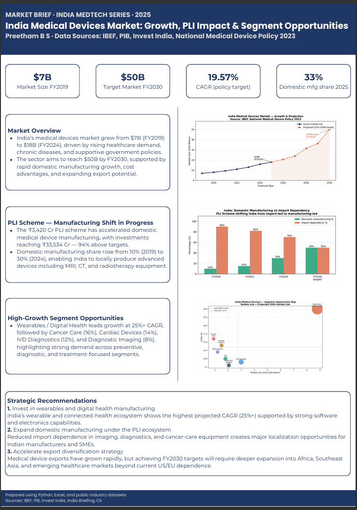
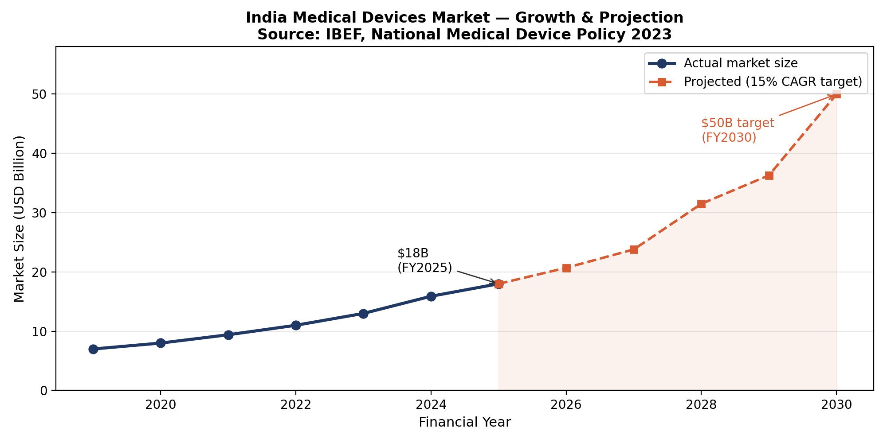
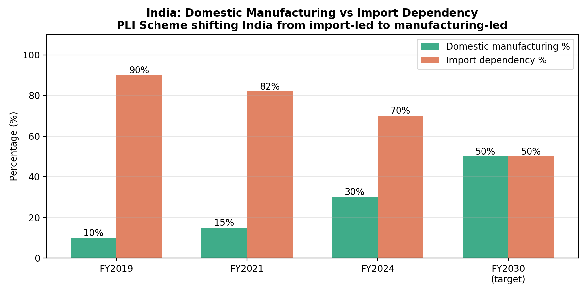
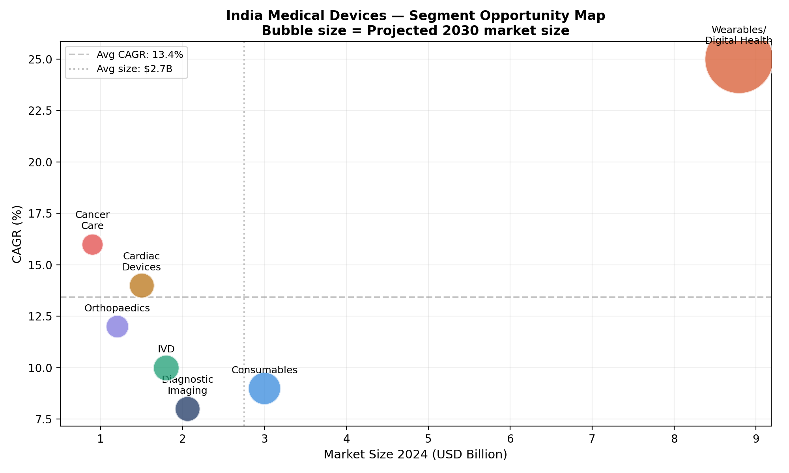

# India Medical Devices Market Analysis (2019–2030)

> **A consulting-style market analysis of India's $18B medical devices industry — covering market sizing, segment opportunity mapping, PLI scheme impact assessment, and trade analysis — delivered as an Excel workbook and a 1-page PDF market brief.**

[](https://microsoft.com/excel)
[](https://python.org)
[](#market-brief)
[](LICENSE)

---

## Project Preview



---

## Table of Contents
- [Background](#background)
- [Analytical Questions](#analytical-questions)
- [Data Sources](#data-sources)
- [Key Findings](#key-findings)
- [Excel Workbook](#excel-workbook)
- [Python Visualisations](#python-visualisations)
- [Market Brief](#market-brief)
- [Strategic Recommendations](#strategic-recommendations)
- [Project Structure](#project-structure)
- [How to Run](#how-to-run)
- [Limitations](#limitations)
- [Author](#author)

---

## Background

India's medical devices sector is undergoing a structural transformation — from an import-dependent market to an emerging manufacturing hub — driven by the National Medical Device Policy 2023, the Production Linked Incentive (PLI) scheme, and a rapidly expanding domestic healthcare infrastructure under Ayushman Bharat.

This project applies market research and business analytics methods to quantify that transformation: how large is the market, which segments are growing fastest, how effective has the PLI scheme been, and where do the highest-opportunity gaps remain?

**Why this project?**
Unlike clinical data projects (which use structured hospital databases), market analysis requires a different skill set — sourcing data from government publications and industry reports, structuring unstructured information into analytical frameworks, calculating business metrics (CAGR, market share, trade balance), and communicating findings in a format suitable for executive or investor audiences.

**Domain context:**
This analysis was conducted by a Medical Electronics engineering graduate with academic exposure to diagnostic systems, wearable sensing technologies, and healthcare device ecosystems. That background helped contextualise the market analysis beyond purely financial metrics — particularly in areas such as diagnostic imaging, IVD systems, wearable health monitoring, and regulatory considerations for medical device adoption.

---

## Analytical Questions

| # | Question | Excel Sheet | Chart |
|---|---|---|---|
| 1 | How has India's medical devices market grown from FY2019 to FY2024, and what does the FY2030 trajectory look like? | Market Size | Chart 1 |
| 2 | What is the CAGR for the overall market and for each segment? | Market Size · Segments | Chart 3 |
| 3 | How has the domestic manufacturing vs import dependency ratio shifted, and why? | Market Size · PLI Impact | Chart 2 |
| 4 | Which segments offer the highest growth opportunity (large market AND high CAGR)? | Segments | Chart 3 |
| 5 | Has the PLI scheme delivered on its targets? By how much? | PLI Impact | — |
| 6 | How have India's medical device exports trended, and what is the gap to the $20B target? | Trade Analysis | — |
| 7 | Who are the dominant players — MNCs vs Indian manufacturers — and how is that balance shifting? | Competitive Landscape | — |

---

## Data Sources

All data was collected from free, publicly available government and industry sources. No paid databases were used.

| Source | Type | Data Collected |
|---|---|---|
| [IBEF — Medical Devices](https://www.ibef.org/industry/medical-devices) | Government (India Brand Equity Foundation) | Market size FY2019–2024, export figures, FDI, manufacturing share |
| [PIB — Press Releases](https://pib.gov.in) | Government (Press Information Bureau) | PLI scheme targets vs actuals, investment realised, companies approved |
| [InvestIndia — Medical Devices](https://www.investindia.gov.in/sector/medical-devices) | Government | FDI inflows, policy highlights, manufacturing clusters |
| [India-Briefing](https://www.india-briefing.com) | Industry analysis | Segment-level CAGR, regulatory updates, CDSCO changes |
| [IMARC Group Reports](https://www.imarcgroup.com) | Market research | Segment sizing cross-validation |
| [Fortune Business Insights](https://www.fortunebusinessinsights.com) | Market research | Diagnostic imaging, IVD segment projections |
| [National Medical Device Policy 2023](https://pib.gov.in/PressReleasePage.aspx?PRID=1920583) | Government policy | FY2030 targets, PLI Category A/B structure |
| [CII — MEDTECH India Reports](https://www.cii.in) | Industry body | Export target of $20B by 2025, trade data |

> A full citation table with URLs and access dates is maintained in the **Sources** sheet of the Excel workbook.

---

## Key Findings

### 1. Market Growth

| Metric | Value |
|---|---|
| Market size FY2019 | ~$7.0B |
| Market size FY2025 | ~$18.0B |
| CAGR FY2019–FY2025 | **17.04%** |
| FY2030 target | **$50B** |
| CAGR required to reach FY2030 target | 22.67% per year |
| India's global market rank | 4th in Asia, ~3% of global market |

### 2. Manufacturing Shift

| Year | Domestic Manufacturing % | Import Dependency % |
|---|---|---|
| FY2019 | 10% | 90% |
| FY2021 | 15% | 82% |
| FY2024 | 30% | 70% |
| FY2030 (target) | 50% | 50% |

> Domestic manufacturing share **tripled** in 5 years — from 10% to 30% — representing one of the fastest localization shifts observed in a high-technology healthcare sector in India.

### 3. PLI Scheme — Dramatically Outperformed

| PLI Metric | Target | Achieved | Achievement % |
|---|---|---|---|
| Total investment | ₹17,275 Cr | ₹33,534 Cr | **194.12%** ✅ |
| Companies approved | 32 | 32 | 100% ✅ |
| Products commissioned | 50 | 57 | 114% ✅ |
| Cumulative sales | ₹5,000 Cr | ₹8,039 Cr | 160.78% ✅ |
| Exports under PLI | ₹3,000 Cr | ₹3,844 Cr | 128.13% ✅ |
| Incentive disbursed | ₹3,420 Cr | ₹3,215 Cr (to 45 companies) | 94.01% |

> The PLI investment realised (₹33,534 Cr) nearly **doubled** the original projected target — one of the strongest indicators of private sector confidence in India's medical device manufacturing potential.

### 4. Export Growth

| Year | Exports |
|---|---|
| FY2022 | ₹19,803 Cr |
| FY2025 | ₹31,120 Cr |
| Growth FY22–FY25 | **57.14%** |
| FY2030 target (CII) | $20B (~₹1,69,000 Cr) |

### 5. Segment Opportunity Map

| Segment | Market Size 2024 | CAGR | Opportunity Rating |
|---|---|---|---|
| Wearables / Digital Health | $8.79B | ~25% | ⭐⭐⭐⭐⭐ Highest |
| IVD (In-vitro Diagnostics) | ~$1.8B | ~10% | ⭐⭐⭐⭐ High |
| Cancer Care / Radiotherapy | ~$0.9B | ~16% | ⭐⭐ Stable |
| Orthopaedics | ~$1.2B | ~12% | ⭐⭐ Stable |
| Diagnostic Imaging | $2.06B | ~8% | ⭐⭐⭐ Medium |
| Cardiac Devices | ~$1.5B | ~14% | ⭐⭐⭐⭐ High |
| Consumables & Implants | ~$3B | ~9% | ⭐⭐⭐⭐ High |

---

## Excel Workbook

**File:** `India_MedDevice_Market_Analysis.xlsx`

The Excel workbook is the primary analytical deliverable — structured as a self-contained market research report with 6 sheets:

### Sheet 1 — Market Size & Growth Timeline

- Year-by-year market size (FY2019–FY2024) with FY2030 projection
- YoY growth % calculated using formula: `=((B4-B3)/B3)*100`
- CAGR calculated using: `=((End/Start)^(1/Years)-1)*100`
- Domestic manufacturing % and import dependency % tracked alongside
- **Line chart:** Actual market size + projected trajectory (dotted line for FY2025–FY2030)
- Conditional formatting: green for growth years, blue highlight for projections

### Sheet 2 — Segment Analysis

- 7 segments with: Market Size 2024, Projected Size 2030, CAGR, Import Dependency, PLI Priority flag, Key Players
- **Opportunity Score:** custom calculated column = CAGR × Market Size 2024 — ranks segments by combined size and growth
- **Bubble chart:** X = Market Size 2024, Y = CAGR, Bubble size = Projected 2030 — three-variable visualisation
- Top-right quadrant = highest opportunity (large AND fast-growing)

### Sheet 3 — Trade Analysis

- Export and import values FY2019–FY2025
- Trade deficit calculated: `=Imports - Exports`
- Export CAGR to FY2030 target calculated (required rate vs current trajectory)
- **Clustered bar chart:** Exports vs Imports side-by-side by year — visually shows trade position improving
- Key insight callout: 88% export growth FY22–FY25 highlighted

### Sheet 4 — PLI Scheme Impact Tracker

- Metric-by-metric comparison: Target vs Achieved vs % Achievement
- Conditional formatting on % Achievement: red < 50%, amber 50–80%, green > 80%
- **Progress bar chart:** Stacked bar showing target vs achieved per metric
- Text callout: "PLI investment surpassed target by 94% — one of the strongest indicators of private sector confidence in India's medical device manufacturing ecosystem"

### Sheet 5 — Competitive Landscape

- 12 companies profiled: 7 MNCs + 5 Indian manufacturers
- Columns: Company, Type, HQ, Key India Products, Revenue (where public), Strategic Move 2023–24
- **Pie chart:** MNC vs Indian company market share split
- Notable trend: Indian players gaining share in consumables and IVD; MNCs dominant in imaging and cardiac

### Sheet 6 — Sources

- Full citation table: Source Name, URL, Type, Date Accessed, Data Used For
- Organised by primary (government) and secondary (industry) sources

---

## Python Visualisations

Three publication-quality charts generated in Python (matplotlib) for the PDF market brief and GitHub README:

### Chart 1 — Market Growth & Projection



*Actual market size FY2019–FY2024 with projected trajectory to FY2030. The gap between current trajectory and the $50B target illustrates the scale of policy ambition required.*

### Chart 2 — Domestic Manufacturing vs Import Dependency



*The PLI scheme's impact is visible in the narrowing gap between domestic manufacturing (green) and import dependency (red). The FY2030 target of 50/50 parity represents a fundamental restructuring of India's device supply chain.*

### Chart 3 — Segment Opportunity Map (Bubble Chart)



*Three-variable visualisation: X-axis = current market size, Y-axis = CAGR, bubble size = projected 2030 value. Top-right quadrant (large + fast-growing) = highest strategic priority. Wearables/Digital Health is the clear standout.*

---

## Market Brief

A 1-page PDF brief was produced as the primary executive deliverable — formatted in the style of published market research reports from Clarivate, IQVIA, and healthcare strategy consulting briefs.

**📄 [Download PDF Market Brief](Market_Brief_India_MedTech_2025.pdf)**

**Brief structure:**
- Header with key KPI callouts
- Market overview paragraph
- PLI impact summary
- High-Growth Segment Opportunities
- 3 strategic recommendations

> **Design principle:** A 1-page market brief forces analytical discipline — every number must earn its place, every sentence must carry insight. This format is used by market research analysts, strategy consultants, and investor relations teams across the healthcare industry.

---

## Strategic Recommendations

### 1. Prioritise Wearables and Digital Health Investment
Wearables represent India's single highest-opportunity segment: $8.79B market, 25% CAGR, and India's established software and sensor engineering talent base provide a genuine competitive advantage over traditional medtech manufacturing hubs (Germany, USA). Recent policy adjustments lowering investment thresholds under PLI Category B create more accessible entry opportunities for Indian startups and SMEs.

**Supporting data:** Wearables CAGR (25%) significantly exceeds the overall medical devices market growth trajectory. India already has 600M+ smartphone users providing a distribution infrastructure for connected health devices.

### 2. Accelerate PLI Category-B Adoption for SMEs
While 32 companies have been approved and 57 products commissioned, the investment realised (₹33,534 Cr) suggests capacity exists to onboard significantly more manufacturers — particularly SMEs in Tier-2 cities with existing precision manufacturing capabilities. The lowered investment threshold in Category B (₹50 Cr vs Category A's ₹500 Cr) is underutilised.

**Supporting data:** PLI investment surpassed target by 94% — indicating the scheme is suggesting strong underlying industry demand for manufacturing expansion.

### 3. Diversify Export Markets Beyond US/EU
Exports grew 57.14% FY22–FY25, but the CII target of $20B by FY2030 requires approximately 40.3% CAGR from current levels — significantly above the current trajectory. Deeper partnerships with Africa, Southeast Asia, and the Middle East — markets with growing healthcare spend and existing India trade relationships — could accelerate export diversification.

**Supporting data:** Current export base is heavily US/EU-concentrated. African medtech import market growing at 10%+ annually with strong preference for cost-effective Indian and Chinese products.

---

## Project Structure

```
india-meddevice-market-analysis/
│
├── README.md
│
├── India_MedDevice_Market_Analysis.xlsx    ← primary analytical deliverable
│
├── notebooks/
│   └── charts.ipynb                        ← Python chart generation code
│
├── Market_Brief_India_MedTech_2025.pdf     ← 1-page executive brief
│
└── outputs/
    ├── chart1_market_growth.png
    ├── chart2_manufacturing_shift.png
    └── chart3_segment_map.png
```

---

## How to Run

### Excel Workbook
```
1. Open India_MedDevice_Market_Analysis.xlsx in Microsoft Excel 2016+
2. Enable editing if prompted
3. All formulas are live — update any cell value to see recalculations cascade
4. Charts update automatically when underlying data changes
```

### Python Charts
```bash
# Install dependencies
pip install matplotlib numpy pandas

# Run the notebook
jupyter notebook notebooks/charts.ipynb

# Or run as script
python notebooks/charts.py
```

**requirements.txt:**
```
matplotlib>=3.6.0
numpy>=1.23.0
pandas>=1.5.0
jupyter>=1.0.0
```

---

## Limitations

| Limitation | Detail |
|---|---|
| Secondary data only | All figures sourced from published reports — no primary surveys or proprietary databases used |
| Cross-source inconsistency | Market size figures vary slightly between IBEF, IMARC, and Fortune Business Insights. This analysis uses IBEF as the primary source (government-backed) and notes discrepancies in the Sources sheet |
| Exchange rate sensitivity | USD figures converted at approximate prevailing rates — INR/USD fluctuation can affect year-on-year comparisons |
| Projection uncertainty | FY2030 projections are policy targets and industry estimates — not guaranteed forecasts |
| Single-country scope | No detailed competitor country analysis (China, Germany, USA) — comparative benchmarking is a natural extension |

---

## Skills Demonstrated

| Skill | Where Applied |
|---|---|
| CAGR calculation | Sheet 1 — formula: `=((End/Start)^(1/n)-1)*100` |
| YoY growth % | Sheet 1 — formula: `=((B4-B3)/B3)*100` |
| Pivot table analysis | Segment and competitive landscape sheets |
| Conditional formatting | PLI tracker — traffic light system |
| Multi-variable bubble chart | Segment opportunity map |
| Clustered bar chart | Trade analysis |
| Market sizing framework | Market opportunity scoring |
| Executive communication | 1-page PDF market brief |
| Source triangulation | Cross-validated figures across 3+ sources |
| Python data visualisation | matplotlib — 3 publication-quality charts |

---

## Author

**Preetham B S** |
B.E. Medical Electronics — M.S. Ramaiah Institute of Technology, Bengaluru (2025) |
Co-author, 3× IEEE International Conference Papers (CompSIF 2025)

📧 bs1preetham2002@gmail.com
🔗 [linkedin.com/in/preetham1bs](https://linkedin.com/in/preetham1bs)
🐙 [github.com/preetham1bs](https://github.com/preetham1bs)

---

*This project was completed as part of a healthcare data analyst and business analyst portfolio. All data is sourced from publicly available government and industry publications. Analysis is for educational and portfolio purposes only.*
